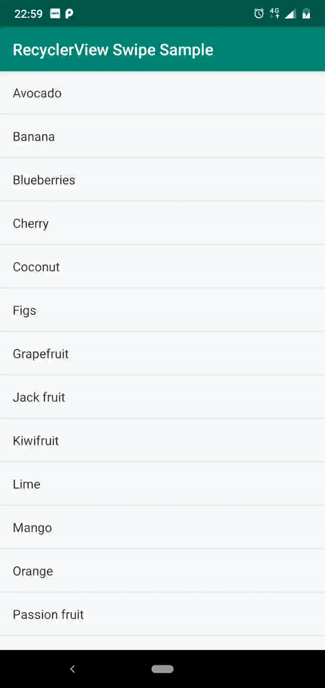

# RecyclerView Touch Playground
A sample app to play around with swipe and drag touch actions of RecyclerView

<pre>
 #     #                         ###           ######                                                   
 #  #  #  ####  #####  #    #     #  #    #    #     # #####   ####   ####  #####  ######  ####   ####  
 #  #  # #    # #    # #   #      #  ##   #    #     # #    # #    # #    # #    # #      #      #      
 #  #  # #    # #    # ####       #  # #  #    ######  #    # #    # #      #    # #####   ####   ####  
 #  #  # #    # #####  #  #       #  #  # #    #       #####  #    # #  ### #####  #           #      # 
 #  #  # #    # #   #  #   #      #  #   ##    #       #   #  #    # #    # #   #  #      #    # #    # 
  ## ##   ####  #    # #    #    ### #    #    #       #    #  ####   ####  #    # ######  ####   ####  
</pre>
# RecyclerView Touch Playground

A sample app to play around with swipe and drag touch actions of RecyclerView.

## Scope

The following things can be done with touch actions:

### Left and Right Full Swipe

Just like Gmail gives an option to swipe a mail in the inbox to archive the item.

### Left/Right partial swipe to show a menu
<pre>
#######           ######         
   #     ####     #     #  ####  
   #    #    #    #     # #    # 
   #    #    #    #     # #    # 
   #    #    #    #     # #    # 
   #    #    #    #     # #    # 
   #     ####     ######   ####  
</pre>
### Drag Item to re order

<pre>
#######           ######         
   #     ####     #     #  ####  
   #    #    #    #     # #    # 
   #    #    #    #     # #    # 
   #    #    #    #     # #    # 
   #    #    #    #     # #    # 
   #     ####     ######   ####  
</pre>

